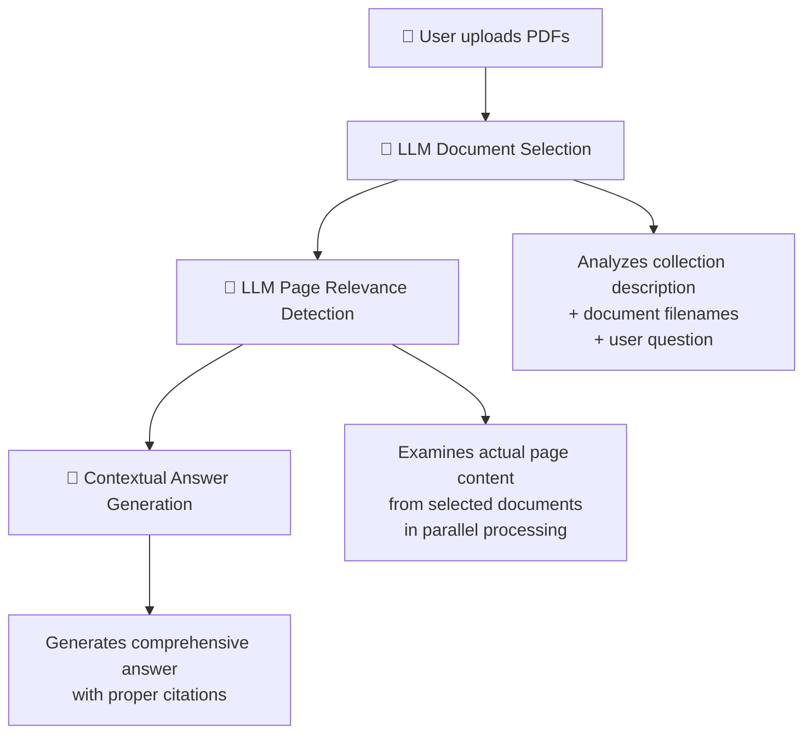

# Vectorless PDF Chatbot

A revolutionary PDF chatbot that uses **no vector embeddings** or traditional RAG. Instead, it leverages Large Language Models for intelligent document selection and page relevance detection, providing a completely stateless and privacy-first experience.

## 🚀 What Makes This "Vectorless"?

Traditional PDF chatbots convert documents into vector embeddings for semantic search. This approach:
- **❌ Requires expensive vector databases**
- **❌ Needs pre-processing and indexing**
- **❌ Stores document data on servers**
- **❌ Loses context and nuance in embeddings**

Our **Vectorless** approach:
- **✅ Uses LLM reasoning instead of vectors**
- **✅ Processes documents in real-time**
- **✅ Completely stateless - no server storage**
- **✅ Preserves full document context**
- **✅ Privacy-first - documents stay in your browser**

## 🧠 How the Vectorless Process Works

### 3-Step Intelligent Document Analysis



### Step 1: 🧠 **Smart Document Selection**
- LLM reads your collection description and document filenames
- Intelligently selects which documents are likely to contain relevant information
- No embeddings needed - uses reasoning and context understanding

### Step 2: 🎯 **Page Relevance Detection**
- LLM examines actual page content from selected documents
- Processes multiple documents in parallel for speed
- Identifies the most relevant pages based on question context

### Step 3: 💬 **Contextual Answer Generation**
- Uses only the relevant pages to generate accurate answers
- Maintains full document context and nuance
- Provides proper citations and references

## ✨ Key Features

### 🔒 **Privacy-First & Stateless**
- **Zero Server Storage**: Documents processed and stored entirely in your browser
- **Client-Side API Keys**: Your API keys stored locally, never sent to our servers
- **LocalStorage Persistence**: Your documents persist across browser sessions
- **No Data Leakage**: Document content never persists on servers
- **Serverless-Friendly**: Perfect for Vercel/Netlify deployments

### 📁 **Advanced File Handling**
- **Up to 100 PDF documents** per session
- **Chunked Upload System**: Automatically handles large file sets (>4.5MB)
- **4.5MB per file limit** - processes substantial documents
- **Real-time Processing**: No pre-indexing required

### 💡 **Intelligent Processing**
- **Multi-Model Support**: OpenAI GPT models + Google Gemini
- **Multi-Provider Architecture**: Flexible AI provider selection
- **Parallel Processing**: Multiple documents analyzed simultaneously
- **Context Preservation**: Full document context maintained throughout
- **Dynamic Descriptions**: Edit collection descriptions anytime

### 🎨 **Modern Interface**
- **Responsive Design**: Works on desktop and mobile
- **Real-time Progress**: Visual feedback during uploads and processing
- **GitHub Integration**: Easy access to source code
- **Error Handling**: Comprehensive error messages and recovery

## 🛠 Technology Stack

### Frontend
- **Next.js 15**: React framework with App Router
- **TypeScript**: Type safety and better development experience
- **Tailwind CSS**: Modern utility-first styling
- **Lucide React**: Beautiful, consistent icons

### Backend (Vercel Functions)
- **Python Functions**: Serverless API endpoints
- **PyPDF2**: Reliable PDF text extraction
- **OpenAI GPT + Google Gemini**: Advanced language models for reasoning
- **Header-Based Authentication**: Client-side API key management
- **Chunked Processing**: Handle large uploads efficiently

### Infrastructure
- **Vercel Deployment**: Seamless serverless hosting
- **No Databases**: Completely stateless architecture
- **Automatic Scaling**: Handle traffic spikes effortlessly

## 🚀 Quick Start

### Prerequisites
- Node.js 18+ and npm
- OpenAI API key and/or Google Gemini API key

### 1. Clone and Install
```bash
git clone https://github.com/roe-ai/vectorless-chatbot.git
cd vectorless-chatbot
npm install
```

### 2. Environment Setup (Optional for Development)
Create `.env.local` for development with server-side keys:
```bash
# Only needed for local development - production uses client-side keys
OPENAI_API_KEY=your_openai_api_key_here
GEMINI_API_KEY=your_gemini_api_key_here
```

### 3. Run Locally
```bash
npm run dev
```
Visit http://localhost:3000

### 4. Configure API Keys (Production)
1. Click "Settings" in the top-left corner
2. Enter your OpenAI and/or Google Gemini API keys
3. Keys are stored locally in your browser only
4. Validate keys to see available models

### 5. Deploy to Vercel
1. Push to GitHub
2. Connect to Vercel  
3. No environment variables needed - uses client-side keys!
4. Deploy! ✅

## 📖 How to Use

### 1. **Configure API Keys**
- Click the "Settings" button in the top-left corner
- Enter your OpenAI API key (for GPT models) or Google Gemini API key
- Both keys are recommended for full model access
- Use "Validate Keys" to test and see available models
- Keys are stored locally in your browser only

### 2. **Upload Your Documents**
- Click "Add Your First Document" or "Add Files"
- Select up to 100 PDF files (4.5MB each max)
- Add a description of your document collection
- Large uploads are automatically chunked for reliability

### 3. **Start Chatting**
- Ask questions about your documents in natural language
- Watch the 3-step process: Document Selection → Page Detection → Answer Generation
- Get detailed answers with timing and cost breakdowns

### 4. **Manage Your Collection**
- Add more documents anytime
- Edit collection descriptions
- Start new sessions as needed
- All data stays in your browser

## 🏗 Architecture Deep Dive

### Stateless Design
```
┌─────────────────┐    ┌──────────────────┐    ┌─────────────────┐
│   Browser       │    │  Vercel Functions │    │   AI Providers  │
│                 │    │                  │    │                 │
│ • LocalStorage  │◄──►│ • /api/upload    │◄──►│ • OpenAI GPT    │
│ • Document Data │    │ • /api/chat/stream│    │ • Google Gemini │
│ • Chat History  │    │ • /api/models    │    │ • Real-time     │
│ • API Keys      │    │ • No Storage     │    │   Processing    │
│ • Session State │    │ • Header Auth    │    │                 │
└─────────────────┘    └──────────────────┘    └─────────────────┘
```

### Chunked Upload System
When uploading large document sets:
1. **Size Detection**: Frontend calculates total upload size
2. **Automatic Chunking**: Splits into 3.5MB chunks if needed
3. **Parallel Processing**: Each chunk processed independently
4. **Progressive Results**: Documents become available as chunks complete
5. **Error Recovery**: Failed chunks can be retried individually

## 🔧 API Endpoints

### `POST /api/upload`
Upload and process PDF documents
- **Input**: FormData with files and description
- **Headers**: X-OpenAI-Key, X-Gemini-Key (optional)
- **Output**: Processed documents with extracted text
- **Features**: Automatic chunking, progress tracking

### `POST /api/chat/stream`
Stream chat responses in real-time
- **Input**: Question, documents, chat history, model selection
- **Headers**: X-OpenAI-Key, X-Gemini-Key (optional)
- **Output**: Server-sent events with processing steps
- **Features**: Real-time progress, cost tracking, citations

### `GET /api/models`
Get available AI models based on provided API keys
- **Headers**: X-OpenAI-Key, X-Gemini-Key (optional)
- **Output**: Available models with provider information
- **Features**: Dynamic model listing, key validation

### `GET /api/health`
Service health check
- **Output**: System status and mode information

## 🎯 Advantages Over Traditional RAG

| Traditional RAG | Vectorless Approach |
|----------------|---------------------|
| 🗄️ Requires vector database | 🚫 No database needed |
| 📊 Pre-processes to embeddings | 🔄 Real-time processing |
| 💰 Expensive infrastructure | 💸 Serverless & cost-effective |
| 🔒 Stores data & keys on servers | 🛡️ Browser-only storage |
| 🔑 Server-side API key management | 🔐 Client-side privacy-first keys |
| 📏 Limited by embedding dimensions | 🧠 Full context understanding |
| ⚡ Fast retrieval, lossy context | 🎯 Accurate reasoning, full context |

## 🌟 Example Workflow

1. **Upload**: Marketing team uploads 50 company PDFs
2. **Describe**: "Company policies, procedures, and guidelines"
3. **Ask**: "What is our remote work policy?"
4. **Process**:
   - 🧠 LLM selects "HR Handbook" and "Remote Work Guidelines"
   - 🎯 Identifies relevant pages about remote work
   - 💬 Generates comprehensive answer with citations
5. **Result**: Accurate answer in ~15 seconds with cost breakdown

## 🔮 Future Enhancements

- **Multi-format Support**: Word docs, PowerPoint, Excel
- **Advanced Citations**: Highlight exact text passages
- **Collaboration Features**: Share sessions with team members
- **Analytics Dashboard**: Usage patterns and insights
- **Custom Models**: Support for local and custom LLMs
- **Batch Operations**: Process multiple questions simultaneously

## 🤝 Contributing

We welcome contributions! This project showcases how modern LLMs can replace traditional vector-based approaches while providing better accuracy and user experience.

## 📄 License

MIT License - see LICENSE file for details.

---

⭐ **Star us on GitHub** if you find this vectorless approach interesting!

Built with ❤️ by [ROE AI Inc.](https://github.com/roe-ai)
